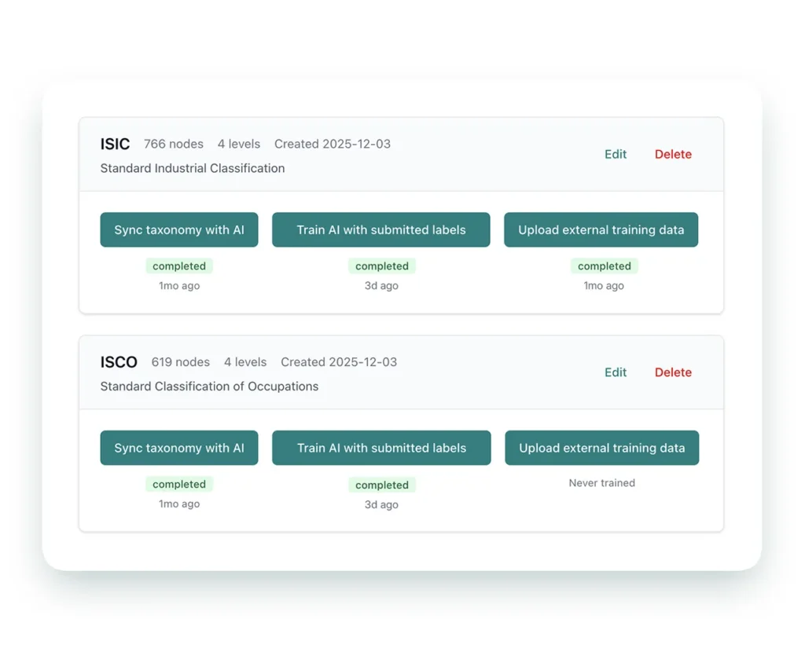
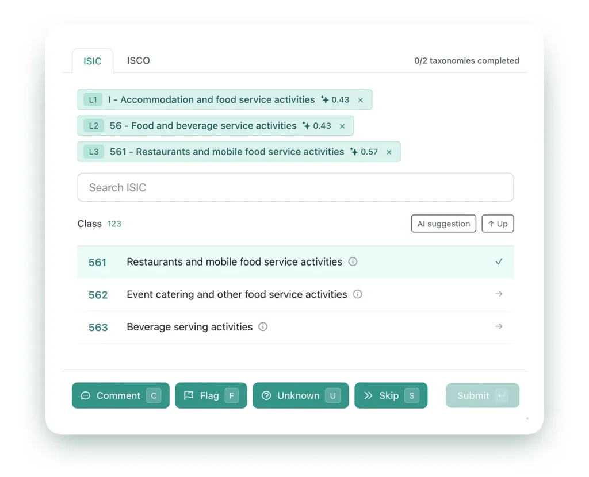
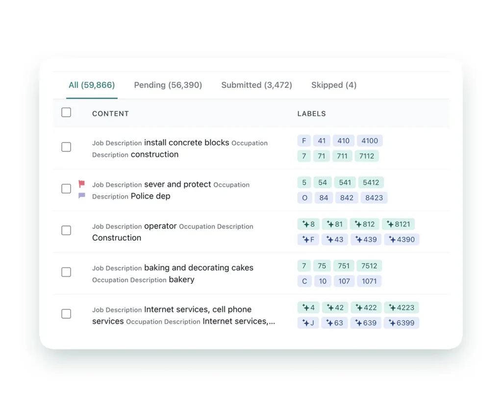
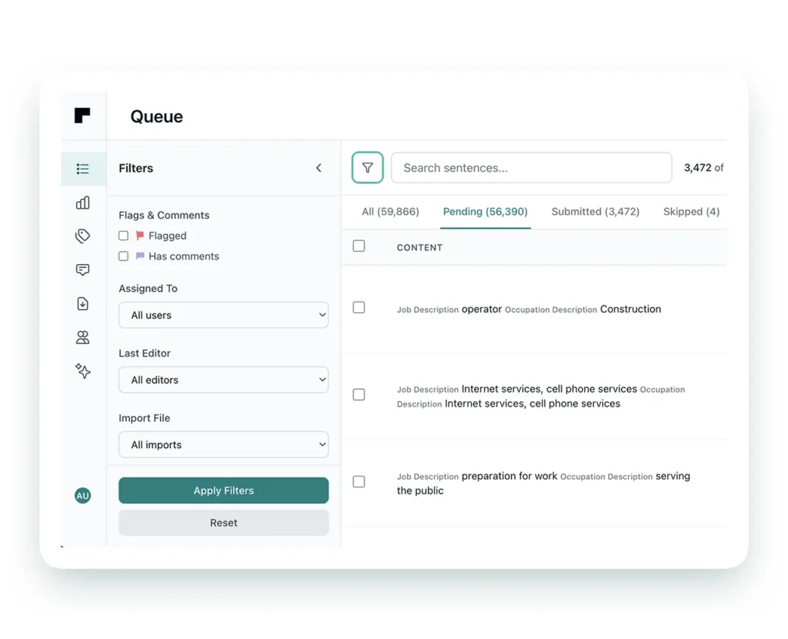

# classiflow-platform


Complex classifications made easy. Open-source, AI-assisted, and user-friendly.
Built for ISCO, ISIC, COICOP, and beyond.


[](docs/assets/classiflow-overview.mp4)


classiflow-platform is the front door for the classiflow ecosystem: documentation,
local development orchestration, and integration guidance for running classiflow
with the optional taxomind AI service.

AI is optional. classiflow runs as a full labeling platform without taxomind.

## Components

- classiflow: labeling UI + database + workflows
- taxomind: optional AI classification service (HTTP API)

## Links

- Website: https://rowsquared.com/classiflow/
- classiflow repo: https://github.com/rowsquared/classifAI
- taxomind repo: https://github.com/rowsquared/taxomind

## Why classiflow

### Faster & Cheaper
Get instant preliminary results from AI, then let your team verify and correct
the suggestions. Time and cost drop as the model learns from corrections.



### Improved Quality
Review and correct AI suggestions to continuously improve quality. Use review and
double-annotation workflows to create gold standards.



### Simple Process Management
Track progress, assign work, and manage workflows in one place. Custom filters,
flexible assignments, and built-in commenting keep teams aligned.



### Solid AI Integration
AI predictions can be wrong. classiflow (via taxomind) keeps humans in control,
so teams review every prediction and teach the model over time.


## Architecture summary

```text
+-----------+        +-------------------+        +------------------------+
| Web users | <----> | classiflow UI/API  | -----> | taxomind API (optional) |
+-----------+        +-------------------+        +------------------------+
                           |
                           v
                      +---------+
                      | Postgres|
                      +---------+
```

- classiflow is the system of record (users, projects, annotations, audits).
- taxomind provides optional AI label suggestions over an HTTP API.
- classiflow authenticates to taxomind with a Bearer token.

## Quickstart (Docker Compose)

Docker images are **not published** for this project. The provided
`dev/docker-compose.yml` builds images locally from source. If Docker or Git
are missing, install them first.

### Prerequisites

- Docker + Docker Compose
- Git

The compose file expects `classiflow-platform`, `classiflow`, and `taxomind` to be
cloned side by side. If they are not, local builds will fail.

1. Clone all three repos side by side:
   ```bash
   mkdir -p classiflow-workspace
   cd classiflow-workspace
   git clone https://github.com/rowsquared/classiflow-platform.git
   git clone https://github.com/rowsquared/classifAI.git
   git clone https://github.com/rowsquared/taxomind.git
   ```
2. Enter the platform repo:
   ```bash
   cd classiflow-platform
   ```
3. Create your local env file:
   ```bash
   cp examples/.env.example .env
   ```
4. Start classiflow (default, no AI):
   ```bash
   docker compose -f dev/docker-compose.yml up -d
   ```
5. Open classiflow:
   - http://localhost:3000

## How to use this platform

- Path A: Run classiflow only (no AI). Use the default compose command (no
  profile). Leave `AI_LABELING_API_URL` and `AI_LABELING_API_KEY` unset or
  blank. See the [classiflow README](https://github.com/rowsquared/classifAI#readme).
- Path B: Run classiflow + taxomind (AI suggestions). Set
  `AI_LABELING_API_URL=http://taxomind:8000` and
  `AI_LABELING_API_KEY=change-me`, then run
  `docker compose -f dev/docker-compose.yml --profile ai up -d`. See the
  [classiflow README](https://github.com/rowsquared/classifAI#readme) and
  [taxomind README](https://github.com/rowsquared/taxomind#readme).
- Path C: Work directly with taxomind (advanced / technical). If you are
  integrating taxomind into another system or developing models, work in the
  taxomind repo directly. See the
  [taxomind README](https://github.com/rowsquared/taxomind#readme).

## Manual setup (advanced)

- Run classiflow from its repository (UI + API + DB).
- Run taxomind from its repository if you want AI suggestions.
- Point classiflow to taxomind with `AI_LABELING_API_URL` and
  `AI_LABELING_API_KEY`.

## Configuration overview

- `.env` at the repo root drives `dev/docker-compose.yml`.
- Common classiflow settings: `NEXTAUTH_SECRET`, `DEFAULT_ADMIN_EMAIL`,
  `DEFAULT_ADMIN_PASSWORD`.
- AI integration settings: `AI_LABELING_API_URL`, `AI_LABELING_API_KEY`.
- For full configuration options, see the classiflow and taxomind docs.

## Documentation

- `docs/usage.md` - responsibilities and interaction overview
- `docs/architecture.md` - components, ports, and integration boundaries
- `docs/local-dev.md` - local dev workflow and troubleshooting
- `docs/deployment.md` - production patterns and scaling
- `docs/integration.md` - classiflow to taxomind configuration

## Project status and maintenance

This project is published as an open-source reference implementation and
working tool.

We welcome bug reports, documentation fixes, and general feedback via GitHub
issues. However, please note that maintenance is intentionally kept at a
low-touch level.

New feature requests, refactors, or roadmap-driven changes are not guaranteed
to be addressed unless they align with our own priorities or ongoing work.

The software is provided **as-is**, without any commitment to continuous
maintenance, backward compatibility, or support timelines.

## Support

Open an issue in the relevant repository:

- UI/workflows: classiflow repo
- AI service: taxomind repo
- Stack/docs: this repository (classiflow-platform)

## License

MIT. See `LICENSE`.
